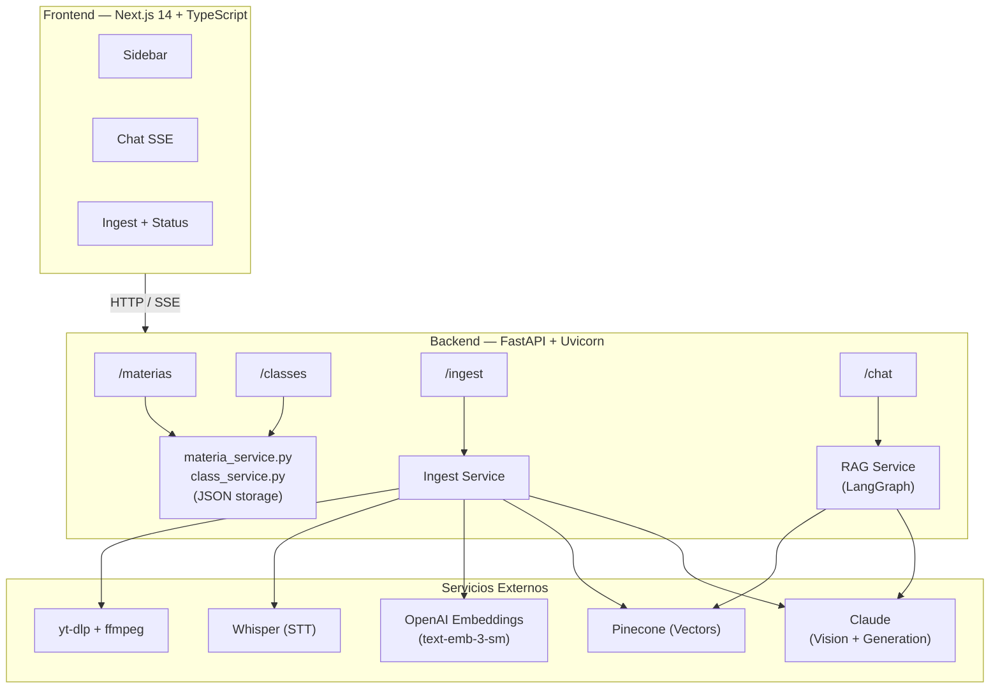
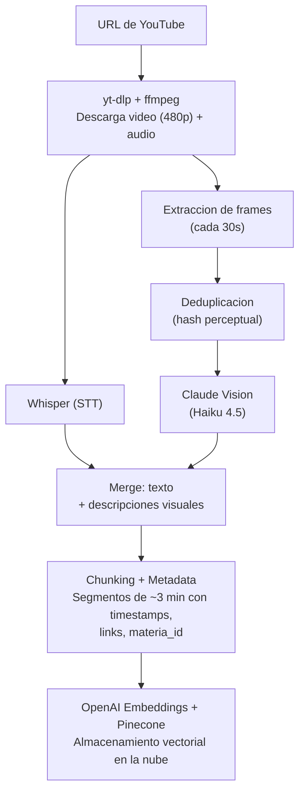
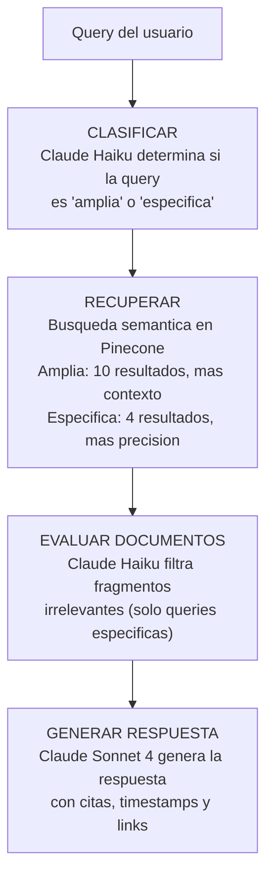

<p align="center">
  
  
  
  
  
  
  
</p>

# Knowly

**Chatea con tus clases universitarias.**

Knowly es un sistema RAG (Retrieval-Augmented Generation) que permite hacer preguntas en lenguaje natural sobre clases universitarias de YouTube. Obtene respuestas precisas con referencias al minuto exacto del video, incluyendo analisis visual de lo que se muestra en pantalla.

---

## Tabla de Contenidos

- [Caracteristicas](#caracteristicas)
- [Arquitectura](#arquitectura)
- [Tech Stack](#tech-stack)
- [Requisitos Previos](#requisitos-previos)
- [Instalacion](#instalacion)
  - [Docker (Recomendado)](#docker-recomendado)
  - [Desarrollo Local](#desarrollo-local)
- [Configuracion](#configuracion)
- [Uso](#uso)
  - [Indexar una Clase](#indexar-una-clase)
  - [Chatear con tus Clases](#chatear-con-tus-clases)
- [API Reference](#api-reference)
- [Pipeline de Ingesta](#pipeline-de-ingesta)
- [Pipeline RAG](#pipeline-rag)
- [Estructura del Proyecto](#estructura-del-proyecto)
- [CLI Legacy](#cli-legacy)

---

## Caracteristicas

- **Chat en lenguaje natural** sobre el contenido de clases universitarias de YouTube
- **Referencias con timestamps** — cada respuesta incluye links directos al minuto exacto del video
- **Analisis visual de video** — extrae y analiza frames para entender diagramas, formulas, codigo y slides mostrados en pantalla
- **Organizacion por materias** — agrupa clases por asignatura para consultas mas contextuales
- **Clasificacion inteligente de queries** — adapta la estrategia de busqueda segun el tipo de pregunta (amplia vs especifica)
- **Streaming en tiempo real** — respuestas via Server-Sent Events para una experiencia fluida
- **Workflow agentico con LangGraph** — pipeline de RAG con nodos de clasificacion, recuperacion, evaluacion y generacion
- **Deduplicacion de frames** — usa hashing perceptual para evitar analizar frames visualmente identicos

---

## Arquitectura



---

## Tech Stack

| Capa | Tecnologia | Uso |
|------|------------|-----|
| **Frontend** | Next.js 14, TypeScript, Tailwind CSS | Interfaz de usuario |
| **Backend** | FastAPI, Uvicorn, Pydantic | API REST |
| **Orquestacion RAG** | LangGraph, LangChain | Workflow agentico |
| **LLM** | Claude Sonnet 4 (generacion), Claude Haiku 4.5 (clasificacion + vision) | Respuestas y analisis |
| **Embeddings** | OpenAI text-embedding-3-small | Vectorizacion de texto |
| **Vector DB** | Pinecone (serverless, free tier) | Almacenamiento y busqueda de vectores |
| **Transcripcion** | OpenAI Whisper (base) | Speech-to-text |
| **Descarga de video** | yt-dlp + ffmpeg | Descarga y procesamiento multimedia |
| **Procesamiento de imagen** | Pillow | Hashing perceptual de frames |
| **Containerizacion** | Docker, Docker Compose | Despliegue |

---

## Requisitos Previos

- **Docker** y **Docker Compose** (para instalacion con Docker)
- **Python 3.11+** y **Node.js 20+** (para desarrollo local)
- **ffmpeg** instalado en el sistema (para desarrollo local)
- **API Key de Anthropic** — [Obtener aqui](https://console.anthropic.com/)
- **API Key de OpenAI** — [Obtener aqui](https://platform.openai.com/api-keys)
- **API Key de Pinecone** — [Obtener aqui](https://app.pinecone.io/)

### Setup de Pinecone (one-time)

1. Crear una cuenta gratuita en [Pinecone](https://app.pinecone.io/)
2. Crear un index con la siguiente configuracion:
   - **Nombre**: `classes`
   - **Dimension**: `1536` (text-embedding-3-small)
   - **Metrica**: `cosine`
   - **Tipo**: Serverless (aws / us-east-1)
3. Copiar la API key y agregarla al archivo `.env`

---

## Instalacion

### Docker (Recomendado)

```bash
# 1. Clonar el repositorio
git clone https://github.com/Nicopiriz18/Knowly.git
cd Knowly

# 2. Configurar variables de entorno
cp .env.example .env
# Editar .env con tus API keys (ANTHROPIC, OPENAI, PINECONE)

# 3. Levantar los servicios
docker-compose up --build
```

Una vez levantado:

| Servicio | URL |
|----------|-----|
| Frontend | http://localhost:3000 |
| Backend API | http://localhost:8000 |
| Documentacion API (Swagger) | http://localhost:8000/docs |

### Desarrollo Local

#### Backend

```bash
cd backend

# Crear y activar entorno virtual
python -m venv .venv
source .venv/bin/activate        # Linux / Mac
# .venv\Scripts\activate         # Windows

# Instalar dependencias
pip install -r requirements.txt

# Iniciar servidor
uvicorn main:app --reload --port 8000
```

#### Frontend

```bash
cd frontend

# Instalar dependencias
npm install

# Iniciar servidor de desarrollo
npm run dev
```

Abrir http://localhost:3000

---

## Configuracion

### Variables de Entorno

Crear un archivo `.env` en la raiz del proyecto:

```env
ANTHROPIC_API_KEY=sk-ant-...
OPENAI_API_KEY=sk-...
PINECONE_API_KEY=pcsk_...
```

### Parametros Avanzados

Los siguientes parametros se pueden ajustar en `backend/config.py`:

| Parametro | Default | Descripcion |
|-----------|---------|-------------|
| `chunk_duration` | `180` | Duracion de cada chunk de transcripcion (segundos) |
| `whisper_model` | `"base"` | Modelo de Whisper para transcripcion |
| `enable_video_analysis` | `true` | Habilitar extraccion y analisis de frames |
| `frame_interval` | `30` | Intervalo de extraccion de frames (segundos) |
| `frame_similarity_threshold` | `5` | Umbral de distancia Hamming para deduplicacion |
| `vision_model` | `"claude-haiku-4-5-20251001"` | Modelo para analisis visual de frames |
| `broad_per_class_results` | `10` | Resultados por clase para queries amplias |
| `broad_n_results` | `10` | Total de resultados para queries amplias |
| `max_context_chars` | `80000` | Limite de caracteres de contexto |
| `pinecone_index_name` | `"classes"` | Nombre del index en Pinecone |

---

## Uso

### Indexar una Clase

1. Abrir http://localhost:3000/ingest
2. Seleccionar o crear una **materia**
3. Pegar la **URL de YouTube** de la clase
4. Ingresar un **titulo** para la clase
5. Hacer clic en **Indexar**

El pipeline de ingesta procesara el video en 6 pasos:

```
Descargando → Transcribiendo → Extrayendo frames → Analizando video → Generando embeddings → Listo
```

### Chatear con tus Clases

1. Ir a http://localhost:3000
2. En el **sidebar**, seleccionar:
   - Una **clase especifica** para consultar solo ese video
   - Una **materia** para consultar todas las clases de esa asignatura
   - **"Todas las materias"** para buscar en todo el contenido indexado
3. Escribir tu pregunta en lenguaje natural
4. La respuesta incluira **citas con timestamps** y links directos a YouTube

---

## API Reference

### Materias

| Metodo | Endpoint | Descripcion | Body |
|--------|----------|-------------|------|
| `GET` | `/materias` | Listar todas las materias con cantidad de clases | — |
| `POST` | `/materias` | Crear nueva materia | `{ "title": "string" }` |
| `DELETE` | `/materias/{materia_id}` | Eliminar materia y todas sus clases | — |

### Clases

| Metodo | Endpoint | Descripcion | Params |
|--------|----------|-------------|--------|
| `GET` | `/classes` | Listar clases indexadas | `?materia_id=` (opcional) |
| `DELETE` | `/classes/{class_id}` | Eliminar clase, chunks y archivos asociados | — |

### Ingesta

| Metodo | Endpoint | Descripcion | Body / Params |
|--------|----------|-------------|---------------|
| `POST` | `/ingest` | Iniciar pipeline de ingesta | `{ "url": "string", "title": "string", "materia_id": "string" }` |
| `GET` | `/ingest/{job_id}` | Consultar estado del job | — |

**Estados del job:** `pending` → `downloading` → `transcribing` → `extracting_frames` → `analyzing_frames` → `embedding` → `done` | `error`

### Chat

| Metodo | Endpoint | Descripcion | Body |
|--------|----------|-------------|------|
| `POST` | `/chat` | Pregunta con RAG (respuesta completa) | `{ "query": "string", "class_id?": "string", "materia_id?": "string" }` |
| `POST` | `/chat/stream` | Pregunta con RAG (streaming SSE) | `{ "query": "string", "class_id?": "string", "materia_id?": "string" }` |

**Respuesta del chat:**

```json
{
  "answer": "La respuesta generada...",
  "sources": [
    {
      "class_title": "Clase 1 - Introduccion",
      "start_time": 120.0,
      "end_time": 300.0,
      "timestamp_link": "https://www.youtube.com/watch?v=VIDEO_ID&t=120s",
      "text": "Fragmento de transcripcion relevante..."
    }
  ]
}
```

---

## Pipeline de Ingesta

El servicio de ingesta transforma un video de YouTube en chunks vectorizados listos para busqueda semantica:



---

## Pipeline RAG

El servicio RAG utiliza **LangGraph** para orquestar un workflow agentico con 4 nodos:



---

## Estructura del Proyecto

```
Knowly/
├── backend/
│   ├── main.py                    # App FastAPI + CORS
│   ├── config.py                  # Configuracion (pydantic-settings)
│   ├── schemas.py                 # Modelos Pydantic (request/response)
│   ├── requirements.txt           # Dependencias Python
│   ├── Dockerfile                 # Imagen Docker del backend
│   ├── routers/
│   │   ├── materias.py            # CRUD de materias
│   │   ├── classes.py             # CRUD de clases
│   │   ├── ingest.py              # Endpoints de ingesta
│   │   └── chat.py                # Chat + streaming SSE
│   └── services/
│       ├── materia_service.py     # Gestion de materias (JSON)
│       ├── class_service.py       # Gestion de clases (JSON)
│       ├── pinecone_client.py     # Cliente Pinecone centralizado
│       ├── ingest_service.py      # Pipeline de ingesta completo
│       └── rag_service.py         # Orquestacion RAG con LangGraph
│
├── frontend/
│   ├── package.json               # Dependencias Node
│   ├── Dockerfile                 # Imagen Docker del frontend
│   └── src/
│       ├── app/
│       │   ├── page.tsx           # Interfaz de chat
│       │   └── ingest/page.tsx    # Interfaz de indexacion
│       ├── components/
│       │   ├── Sidebar.tsx        # Navegacion (materias/clases)
│       │   └── ChatMessage.tsx    # Mensajes con fuentes y markdown
│       └── lib/
│           └── api.ts             # Cliente API tipado
│
├── data/                          # Datos generados
│   ├── materias.json              # Metadata de materias
│   ├── classes_registry.json      # Registro de clases indexadas
│   ├── audio/                     # Archivos de audio (MP3)
│   ├── transcripts/               # Transcripciones (JSON)
│   ├── raw_videos/                # Videos descargados (temporal)
│   ├── frames/                    # Frames extraidos (temporal)
│   └── visual/                    # Descripciones visuales (JSON)
│
├── docker-compose.yml             # Orquestacion Docker
├── .env.example                   # Template de variables de entorno
│
├── ingest.py                      # CLI legacy - ingesta
├── rag.py                         # CLI legacy - RAG
└── chat.py                        # CLI legacy - chat interactivo
```

---

## CLI Legacy

Los scripts CLI originales siguen funcionando para uso directo:

```bash
# Indexar un video
python ingest.py --url "https://www.youtube.com/watch?v=..." --title "Clase 1" --class_id "clase_01"

# Chat interactivo por terminal
python chat.py
```

---

## Licencia

Este proyecto es de uso privado.
